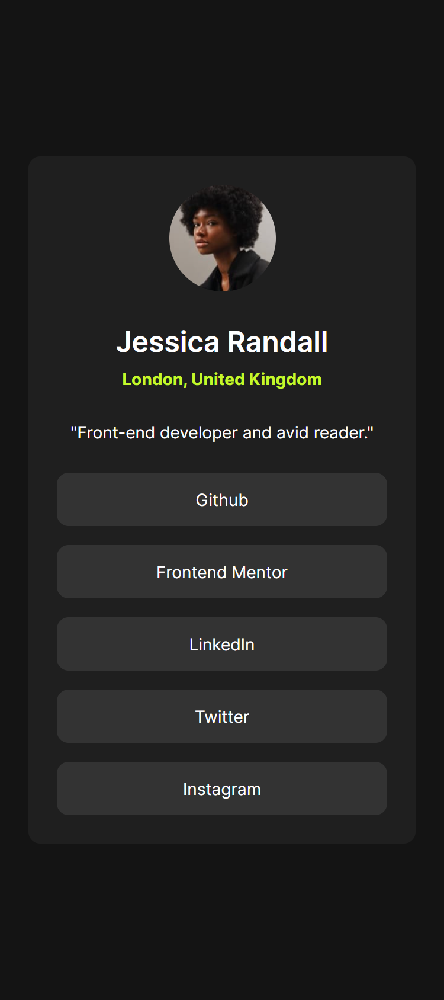
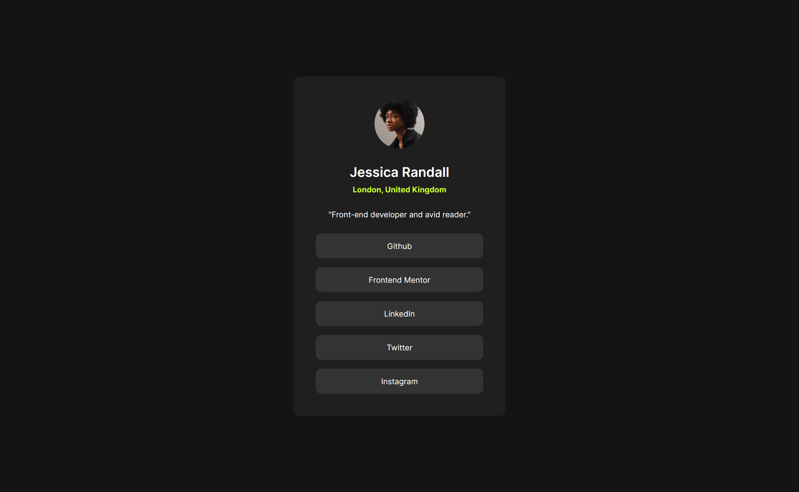
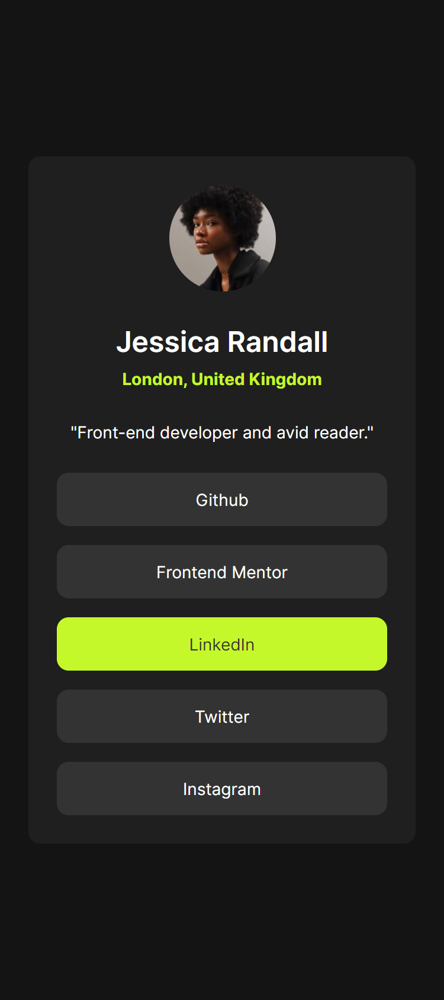

# Frontend Mentor - Social links profile solution

This is a solution to the [Social links profile challenge on Frontend Mentor](https://www.frontendmentor.io/challenges/social-links-profile-UG32l9m6dQ). Frontend Mentor challenges help you improve your coding skills by building realistic projects. 

## Table of contents

- [Overview](#overview)
  - [The challenge](#the-challenge)
  - [Screenshot](#screenshot)
  - [Links](#links)
- [My process](#my-process)
  - [Built with](#built-with)
  - [What I learned](#what-i-learned)
  - [Continued development](#continued-development)
  - [Useful resources](#useful-resources)
- [Author](#author)

## Overview

### The challenge

- To create card layout for person with its basic info and social links
- Users should be able to:
    * See hover and focus states for all interactive elements on the page

### Screenshot

<figure style="height:auto;width:100%;width:auto;display:flex;flex-direction:row;flex-wrap:wrap;justify-content:center;text-align:center">
    <div style="display:flex;flex-direction:row;flex-wrap:wrap;justify-content:center;align-content:center;gap:5px;width:100%">
        
        
        
    </div>
    <figcaption style="flex:1;width:100;font-style:italic">
        <em>My solution for mobile (left) and desktop (center) devices and hover state (right).</em>
    </figcaption>
</figure>


### Links

- Solution URL: [GitHub](https://github.com/MiloosN5/FrontendMentor_SocialLinksProfileMain)
- Live Site URL: [GitHub Pages](https://miloosn5.github.io/FrontendMentor_SocialLinksProfileMain/)

## My process

### Built with

- Semantic HTML5 markup
- SASS/SCSS
- BEM
- Flexbox
- Mobile-first workflow
- REM (Root EM) & EM (for Responsive)
- Responsive layout
- [React](https://reactjs.org/) - JS library
- Components

### What I learned

**Person card layout** <br>

- The most important thing for person's career to introduce himself/herself in most efficient way. This type of card can encapsulate the most important info about someone into one part. According to the layout, this card is consisted of two main parts - its introduction (person's basic info) and links that can help you get to know more about the person. To help other developers understand our layout, we should use semantic HTML. The layout of the card can be structured to wrap everything inside an article. Its purpose is to serve as independent content that you can cut off from one place and paste somewhere else and still make sense. Inside that article, an introduction can be seen as a header and links as a navigation with links. 
- Creating a solution for this project wasn't complex. However, this project helped me thinking in advance about how to organize the layout if the new cards will be later applied. For that reason, some parts were created as a components in order to be reusable. The only thing that can vary is the content of the component, so, for that reason there are props.  

   * App.jsx
        ```jsx
        const App = () => {
            const users = [...];

            return (
                <div className='page'>
                    <header className='sr-only'>
                        <h1>Cards</h1>
                        <p>Cards of developers info and links to their profiles on the external websites</p>
                    </header>
                    <main>
                        {users.map((user, index) => (
                            <Card key={index} user={user} />
                        ))}
                    </main>
                </div>
            )
        }               
        ```
    * Card.jsx component
        ```jsx 
        const Card = ({ user }) => {
            return (
                <article className='card'>
                    <header className='card__introduction'>
                        <ImageCard 
                            src={user.picture.src} 
                            alt={user.picture.alt} 
                        />
                        <div>
                            <h2>{user.name}</h2>
                            <p className='text--location'>{user.location}</p>
                        </div>
                        <p>"{user.position}"</p>
                    </header>
                    <nav className='card__links'>
                        <ListUnordered 
                            items={user.socials} 
                            types='accent, unordered' 
                        />
                    </nav>
                </article>
            )
        }
        ```
    * datas that are send as a props (inside App.jsx)
        ```jsx 
        const App = () => {
            const users = [
                { 
                    name: 'Jessica Randall', 
                    location: 'London, United Kingdom', 
                    position: 'Front-end developer and avid reader.',
                    picture: {
                        src: Avatar1,
                        alt: 'Avatar or image of person'
                    },
                    socials: {
                        github: {
                        name: 'Github',
                        URL: 'https://www.google.com/'
                        },
                        frontendMentor: {
                        name: 'Frontend Mentor',
                        URL: 'https://www.google.com/'
                        },
                        linkedIn: {
                        name: 'LinkedIn',
                        URL: 'https://www.google.com/'
                        },
                        twitter: {
                        name: 'Twitter',
                        URL: 'https://www.google.com/'
                        },
                        instagram: {
                        name: 'Instagram',
                        URL: 'https://www.google.com/'
                        },
                    }
                }
            ];

            return (
                ...
                <Card key={index} user={user} />
                ...
            )
        }
        ```

### Continued development

- Striving for even better organization of code by dividing it into components as well as organization for styling (better handling of mixins). Also, for this certain situation, to make an even better layout of a person's card.


### Useful resources

- [How to Build Reusable React Components](https://www.freecodecamp.org/news/how-to-build-reusable-react-components/) - Creating reusable components can lead to better organization, more readability, and better management of data changes. 
- [@mixin and @include](https://sass-lang.com/documentation/at-rules/mixin/) - Having all logic in one place is more practical, not only for reusability but also for an easier way to handle changes in style behavior.

## Author

- GitHub - [MiloosN5](https://github.com/MiloosN5)
- Frontend Mentor - [@MiloosN5](https://www.frontendmentor.io/profile/MiloosN5)
- Exercism [milos-novakovic-pro](https://exercism.org/profiles/milos-novakovic-pro)
- LinkedIn [Milos Novakovic](https://www.linkedin.com/in/milos-novakovic-1a9517263/)


